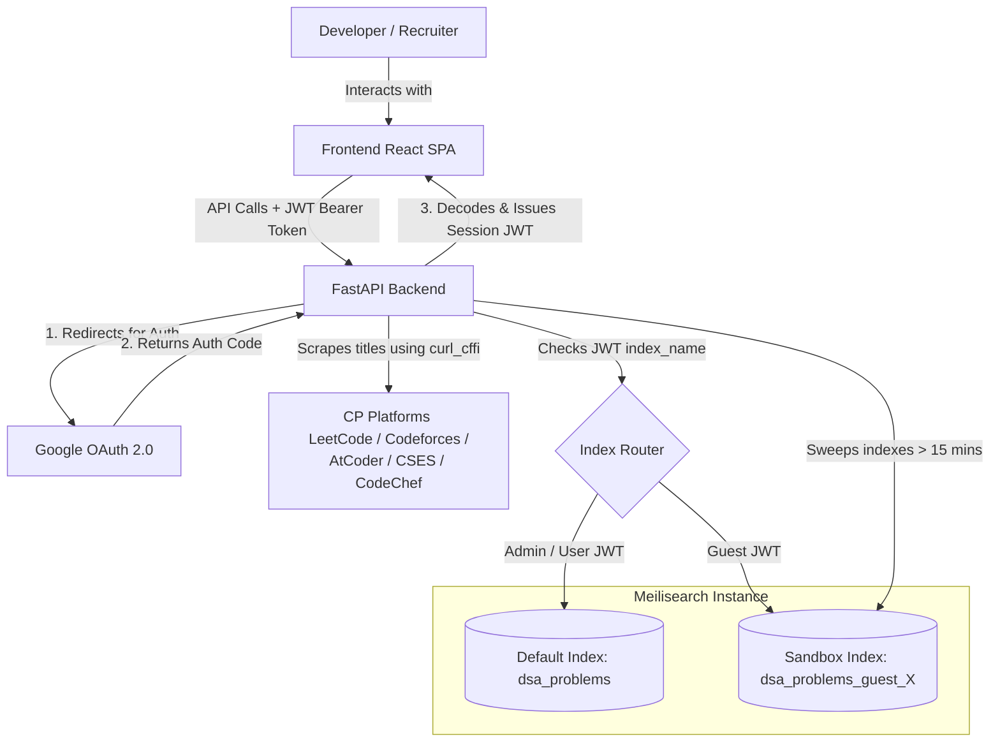

# CP Problem Finder

[](https://fastapi.tiangolo.com/)
[](https://react.dev/)
[](https://www.meilisearch.com/)
[](https://www.docker.com/)
[](https://opensource.org/licenses/MIT)

> A blazing fast personal knowledge management system and search engine for Competitive Programming (CP) and Data Structures & Algorithms (DSA) problems. Organize, filter, and review your solved problems across LeetCode, Codeforces, AtCoder, CodeChef, and CSES in milliseconds.

---

## 💡 Motivation

During competitive programming contests, developers often recall solving a similar problem in the past but struggle to quickly locate it among hundreds or thousands of previously solved problems. Existing browser bookmarks, text files, and platform-specific submission histories are highly inefficient for **pattern-based retrieval** (e.g., retrieving all problems matching `dynamic programming` + `greedy` with a `Medium` difficulty).

**CP Problem Finder** was built to solve this exact problem. It acts as a specialized personal knowledge management system that lets developers catalog their solved problems with fine-grained tags, structured markdown notes, and perform lightning-fast fuzzy searches to find identical patterns during contests or interview preparation.

---

## 🚀 Features

- 🔑 **Google Authentication:** Secure, passwordless login integrated with Google OAuth 2.0.
- 🧪 **Demo Workspace (Guest Mode):** Instant, one-click access to a fully isolated, sandboxed environment. Try out all admin CRUD actions safely without registration.
- 📝 **Problem CRUD:** Add, update, or delete problems. The system dynamically scrapes problem titles directly from platform URLs.
- 🏷️ **Tag-based Organization:** Group problems by specific algorithmic techniques (e.g., `segment trees`, `graphs`, `recursion`).
- 🔍 **Instant Fuzzy Search:** Search-as-you-type searching across titles, tags, and platforms powered by Meilisearch.
- 📊 **Difficulty Categorization:** Classify problems by difficulty levels (`Easy`, `Medium`, `High`).
- ✍️ **Markdown Notes:** Add rich observations, templates, edge cases, or code snippets to each problem using an interactive side-drawer.
- 🌓 **Dark & Light Mode:** Seamless, system-matching theme switcher.
- 📱 **Fully Responsive UI:** Clean desktop and mobile views built from scratch with custom CSS variables.
- 🛡️ **Role-Based Access Control (RBAC):** Restricts data modification to verified administrators, keeping public indices read-only.

---

## 🧪 Demo Workspace (Guest Mode)

The **Demo Workspace** is designed specifically for recruiters, interviewers, and developers evaluating the codebase:
- **Sandbox Isolation:** Clicking *Continue as guest* creates a session-specific, isolated Meilisearch index (`dsa_problems_guest_{timestamp}_{uuid}`) seeded with initial dummy problems.
- **Full CRUD Capabilities:** Guests are granted temporary admin rights to add, update, delete, or write notes for any problem in their sandbox.
- **Safety & Protection:** Production data is completely protected from unauthorized edits, and concurrent guest workspaces never interfere with each other.
- **Automated Memory Cleanup:** Sandbox indices are automatically cleaned up in two ways:
  1. Immediately when the guest logs out.
  2. Via a FastAPI background worker that sweeps and deletes sandbox indices older than 15 minutes.

---

## 📸 Screenshots

*Screenshots of the dashboard, search filters, and markdown notes drawer will be added in a future update.*

| Dashboard (Dark Mode) | Add Problem Interface |
|:---:|:---:|
| *[Placeholder: Dashboard Main View]* | *[Placeholder: Add Problem Dialog]* |

| Markdown Notes Drawer | Theme Support |
|:---:|:---:|
| *[Placeholder: Markdown Preview & Editor]* | *[Placeholder: Light Mode Toggle]* |

---

## 🛠️ Tech Stack

| Layer | Technology | Key Role |
|---|---|---|
| **Frontend** | React 19, TypeScript, Vite | Single Page Application (SPA), state management, UI modules |
| **Backend** | Python, FastAPI, Uvicorn | High-performance asynchronous API, routing, scrapers, and background tasks |
| **Search Engine** | Meilisearch | Lightning-fast fuzzy search, indexing, filtering, and facets |
| **Authentication** | Google OAuth 2.0, PyJWT | External identity provider and stateless JWT session management |
| **Impersonator** | `curl_cffi` | Bypasses Cloudflare anti-bot checks to scrape problem titles |
| **State & Cache** | Zustand, TanStack React Query | Lightweight auth store and robust query/mutation caching |
| **Reverse Proxy** | Caddy | SSL termination and request routing (Production) |
| **Containerization**| Docker, Docker Compose | Consistent local running environment and deployment orchestration |

---

## 📐 Architecture

The diagram below shows the high-level architecture of CP Problem Finder, highlighting how request routing, authentication, and database sandbox isolation are handled:



---

## 📁 Folder Structure

```
cp-problem-finder/
├── backend/                  # FastAPI Application
│   ├── main.py               # API routes, business logic, scrapers, and index setup
│   ├── test_scrapers.py      # Async test suite for platform scrapers
│   ├── Dockerfile            # Container build for python API
│   ├── docker-compose.yml    # Meilisearch and Backend services
│   ├── Caddyfile             # Caddy reverse proxy config
│   └── requirements.txt      # Python dependencies
└── frontend/                 # React Vite Application
    ├── src/
    │   ├── components/       # UI Components (Header, Table, Drawers, Modals)
    │   ├── stores/           # Zustand Auth store
    │   ├── types.ts          # TypeScript type definitions
    │   ├── App.tsx           # Application wrapper & query mutations
    │   └── main.tsx          # React application root mount
    ├── package.json          # Node scripts and dependencies
    └── vite.config.ts        # Vite compiler configurations
```

---

## 🚀 Getting Started

Ensure you have [Docker](https://www.docker.com/) and [Node.js](https://nodejs.org/) (v18+) installed on your machine.

### 1. Run the Backend & Database (Docker)
Navigate to the backend directory, set up your configuration, and start the containers:
```bash
cd backend
cp .env.example .env
docker-compose up --build -d
```
*For detailed variables and testing steps, see the [Backend README](file:///d:/Projects/cp-problem-finder/backend/README.md).*

### 2. Run the Frontend (Vite)
Open a new terminal, navigate to the frontend directory, install dependencies, and run the dev server:
```bash
cd frontend
npm install
npm run dev
```
*For detailed UI parameters and build options, see the [Frontend README](file:///d:/Projects/cp-problem-finder/frontend/README.md).*

---

## 🛡️ Authorization Model

The application enforces a stateless JWT-based Role-Based Access Control (RBAC) model:

| Role | Target Database Index | Read Search | Write Problems (CRUD) | Edit Notes |
|---|---|---|---|---|
| **Guest** | Isolated Sandbox Index | ✅ Yes | ✅ Yes (Isolated Sandbox) | ✅ Yes (Isolated Sandbox) |
| **Registered User** | Production Default Index | ✅ Yes | ❌ No | ❌ No |
| **Admin** | Production Default Index | ✅ Yes | ✅ Yes (Production) | ✅ Yes (Production) |

---

## 🧠 Design Decisions

### 1. Why Google Authentication?
- **Security:** Outsources credential storage, password hashing, and login security to Google's production infrastructure.
- **Convenience:** Allows users to log in with a single click without having to manage another password.

### 2. Why Demo Workspace (Guest Mode)?
- **Frictionless Testing:** Recruiters and developers can test write actions (adding, editing, deleting problems, and writing notes) immediately without needing to authenticate via Google.
- **Security & Scalability:** Running guest actions on isolated, short-lived database namespaces protects production search data from spam and prevents database bloat.

### 3. Why Structured Markdown Notes?
- **Contest Readiness:** Competitive programming requires noting specialized corner cases (e.g., $N=1$, integer overflow) and linking to related templates. Plain text is insufficient; markdown allows rendering code blocks and formatted tables inside the Notes drawer.

### 4. Why Fuzzy Title & Tag-based Search?
- **Mental Association & Context:** Programmers often search for problems either by their exact name (title) or by algorithmic categories (tags) and platforms. Indexing on `title`, `tags`, and `platform` in Meilisearch allows users to locate problems instantly, whether they are retrieving a specific known problem or searching for a general pattern/strategy.

---

## 🛠️ Challenges & Solutions

### Cloudflare & Bot Protection Bypass (Scrapers)
- **Challenge:** Platforms like Codeforces and CodeChef use Cloudflare to protect against scraping, returning `403 Forbidden` errors when queried via standard Python `httpx` or `urllib` clients.
- **Solution:** Integrated `curl_cffi` inside our scraper strategy pattern. `curl_cffi` impersonates browser TLS signatures (impersonating `chrome120`), tricking anti-bot protection mechanisms and successfully extracting HTML titles.

### Dynamic Sandboxed Index Redirection
- **Challenge:** Traditional backend models point to a single static database connection. Supporting multiple guest users editing lists concurrently would corrupt the mock workspace.
- **Solution:** Implemented dynamic database routing by placing the target `index_name` inside the JWT claims. The `/search`, `/problems`, and `/problems/{id}` routes extract the user's specific database namespace from the token and query the corresponding Meilisearch index dynamically.

### Sandbox Garbage Collection
- **Challenge:** Guests creating workspaces but not logging out would leave abandoned indices, bloating Meilisearch memory.
- **Solution:** Added a background task to the `/auth/guest` endpoint. Each guest login triggers an asynchronous garbage collection sweeper that parses all index names, compares creation timestamps, and deletes any guest index older than 15 minutes.

---

## 🔮 Future Roadmap

- [ ] **AI Tag Suggestion:** Automatically parse problem text and suggest relevant tags.
- [ ] **Similar Problem Recommendation:** Recommend similar problems using vector embeddings.
- [ ] **Revision Planner:** A spaced-repetition scheduler that flags problems for revision.
- [ ] **Import Scripts:** Batch import solved problems directly using Codeforces handles and LeetCode usernames.
- [ ] **Code Snippet Storage:** Save multiple language solutions (C++, Python, Java) inside the markdown notes.

---

## 📝 License

Distributed under the MIT License. See `LICENSE` for more information.
