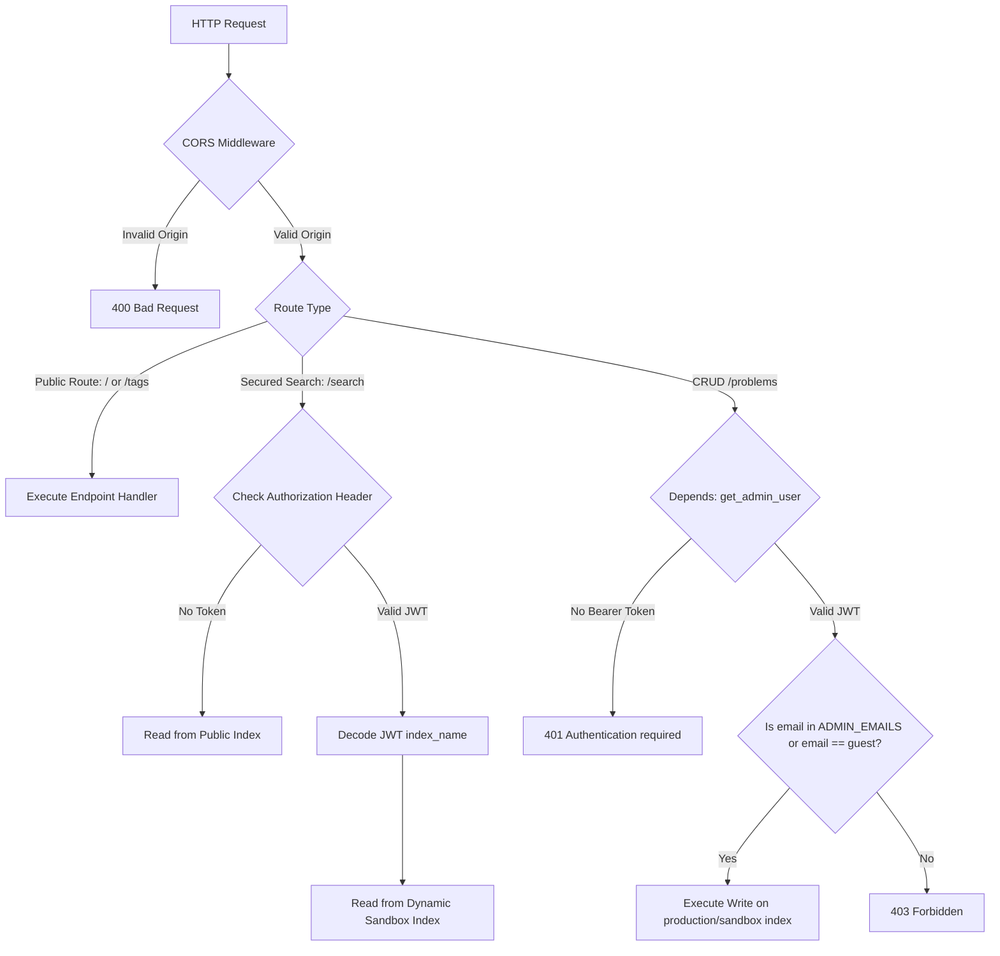
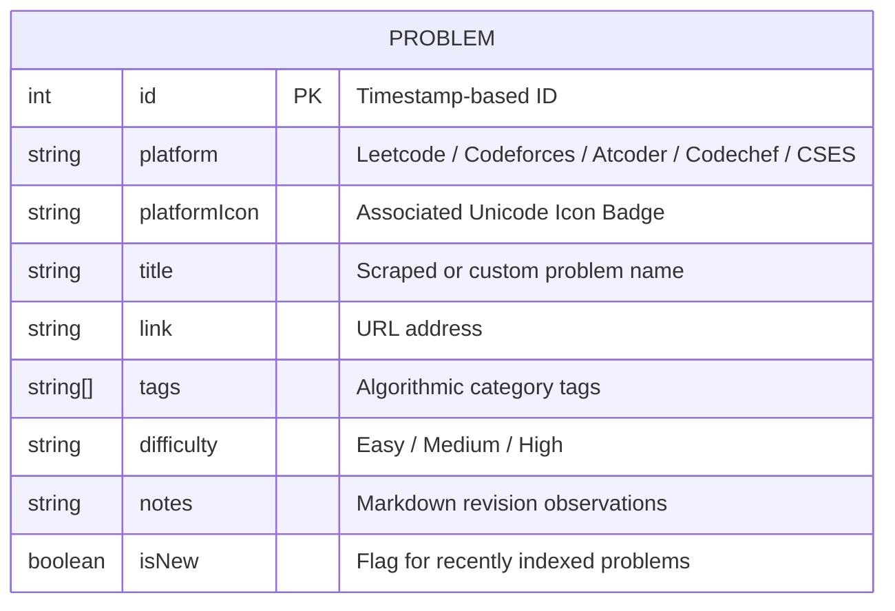

# CP Problem Finder - Backend API

A high-performance asynchronous REST API built with **FastAPI**, **Meilisearch**, and **Google OAuth 2.0**. It exposes endpoints for real-time problem search, custom platform scraping, admin-level CRUD operations, and sandbox index setups for guest sessions.

---

## 📖 Overview

The CP Problem Finder backend functions as the search coordinator and scraping engine. It stores and queries problems using Meilisearch. The application supports role-based access control (RBAC), automatically generating individual guest sandbox workspaces on demand and cleaning them up via background schedules.

---

## ⚙️ Architecture & Design Patterns

The backend incorporates several design patterns:
1. **Strategy Pattern (Scrapers):** Isolates the logic for retrieving page titles from different competitive programming sites. Scrapers utilize `curl_cffi` to mimic browser handshakes (impersonating `chrome120`) to bypass anti-bot and Cloudflare verification walls.
2. **Stateless Sessions (JWT):** Encodes user identity, email, role, and current isolated database `index_name` directly into the token payloads to enforce RBAC without keeping sessions in memory.
3. **Dynamic Multi-Tenancy:** Routes database requests to dynamic Meilisearch index names (`dsa_problems_guest_...`) decoded from JWT claims, preventing database pollution.

---

## 📁 Folder Structure

```
backend/
├── .env                  # Active configuration keys (JWT keys, OAuth keys)
├── .env.example          # Baseline template keys
├── Dockerfile            # Python slim build image parameters
├── docker-compose.yml    # Services configurations (FastAPI + Meilisearch)
├── Caddyfile             # Reverse proxy domain mapping (Production)
├── main.py               # Application entrypoint containing routing, schemas, and logic
├── test_scrapers.py      # Script to verify platform scraping strategies
└── requirements.txt      # Python dependencies list
```

---

## 🔒 Authentication & Authorization (RBAC)

The backend uses a stateless JWT Bearer token authentication mechanism. Roles are mapped as follows:

1. **Guest:** Authenticates via `/auth/guest`. Receives a JWT with role `admin` and an isolated, session-scoped index name (e.g., `dsa_problems_guest_1680000000_abc123`). Authorized to perform full CRUD operations inside their own sandbox.
2. **Registered User:** Authenticates via Google OAuth. If their email is not in the `ADMIN_EMAILS` environment variable, they receive a JWT with role `user` pointing to the public `dsa_problems` index. Authorized to perform read-only searches.
3. **Admin:** Authenticates via Google OAuth. If their email matches `ADMIN_EMAILS`, they receive a JWT with role `admin` pointing to the default `dsa_problems` index. Authorized to perform CRUD operations on the production database.

### Middleware Execution & Authorization Flow
Requests are piped through FastAPI dependencies to enforce RBAC:



---

## 🔌 API REST Endpoints

The API is fully documented using interactive Swagger documentation, available at `/docs` when running locally.

| Method | Route | Description | Authentication | Required Role |
|---|---|---|---|---|
| **GET** | `/` | Health check endpoint returning API status | ❌ None | None |
| **GET** | `/tags` | Returns the list of all available algorithmic topic tags | ❌ None | None |
| **GET** | `/search` | Queries problems using Meilisearch. Supports limit, offset, and filters | 🟡 Optional | `user` or `admin` (Default public index if unauthenticated) |
| **POST** | `/problems` | Submits a new problem. Triggers scraper strategy based on URL | ✅ Bearer | `admin` |
| **PUT** | `/problems/{id}` | Partially updates title, tags, difficulty, or notes | ✅ Bearer | `admin` |
| **DELETE** | `/problems/{id}`| Removes a problem document from the index | ✅ Bearer | `admin` |
| **GET** | `/auth/guest` | Logs in guest, initializes dynamic sandbox index, and returns JWT | ❌ None | None (Generates guest admin) |
| **GET** | `/auth/login` | Redirects client to Google OAuth authorization page | ❌ None | None |
| **GET** | `/auth/callback`| Callback endpoint for Google OAuth. Validates code, issues session JWT| ❌ None | None (Sets role based on email) |
| **POST** | `/auth/logout` | Invalidates session and instantly deletes guest index sandbox | ✅ Bearer | `user` or `admin` |

---

## 🏷️ Models & Pydantic Validation

FastAPI leverages **Pydantic** models to validate payload content and verify structural types:

### 1. `ProblemCreate`
Used for creating new problems. Validates URLs and cross-references them against chosen platforms:
- **`link`**: Must be a valid HTTP/HTTPS URL.
- **`platform`**: Must be one of `Leetcode`, `Codeforces`, `Atcoder`, `Codechef`, `CSES`.
- **`difficulty`**: Level indicator.
- **`tags`**: Array of topic strings.
- **`notes`**: Custom markdown text.
- **Domain Constraint:** A Pydantic `@model_validator` checks that the domain matches the selected platform (e.g., `leetcode.com` for Leetcode).

### 2. `ProblemUpdate`
Used for updates. Allows editing tags, difficulty, and notes:
- **Restriction:** Changing the `link` or `platform` is strictly blocked and returns a `400 Bad Request` to preserve integrity.

---

## 🗄️ Database Schema & Meilisearch Index

Instead of relational tables, problems are saved as flat JSON documents. Meilisearch is configured on startup via **FastAPI Lifespan Context** triggers:

### Document Attributes Schema


### Meilisearch Index Configurations
- **Searchable Attributes:** `["title", "tags", "platform"]` (Dictates fields Meilisearch scans during text queries).
- **Filterable Attributes:** `["platform", "difficulty", "tags", "isNew", "link"]` (Enables query scoping).

---

## ⚙️ Environment Variables

Copy `.env.example` to `.env` in the `backend/` directory and configure the variables:

| Variable | Description | Default / Example Value |
|---|---|---|
| `MEILI_URL` | URL of the running Meilisearch engine | `http://127.0.0.1:7700` (Use `http://meilisearch:7700` in Docker) |
| `MEILI_MASTER_KEY` | Master credential to access Meilisearch | Must be at least 16 bytes for production security |
| `INDEX_NAME` | Main search index for production problems | `dsa_problems` |
| `GOOGLE_CLIENT_ID` | OAuth Client ID from Google Cloud | `572394029926-sg66mu...` |
| `GOOGLE_CLIENT_SECRET` | OAuth Secret from Google Cloud | `GOCSPX-zG-oLv...` |
| `GOOGLE_REDIRECT_URI` | Authorized callback url endpoint | `https://dsasearch.duckdns.org/auth/callback` |
| `JWT_SECRET` | Secret key used to sign JWT session hashes | High-entropy string |
| `JWT_ALGORITHM` | Algorithm used to generate JWTs | `HS256` |
| `JWT_EXPIRATION_MINUTES`| Validity window of the JWT session token (in minutes) | `10` |
| `FRONTEND_URL` | Redirect address where the React SPA runs | `https://cp-problem-finder.vercel.app` |
| `ADMIN_EMAILS` | Comma-separated list of administrative emails | `shubham.coding841@gmail.com,` |

---

## 🚀 Local Development Setup

### 1. Prerequisites
- Python 3.11+
- Docker & Docker Compose
- Virtualenv (`python -m venv`)

### 2. Running the Database (Docker)
Run Meilisearch as a daemon container:
```bash
docker run -d \
  -p 7700:7700 \
  -v "$(pwd)/meili_data:/meili_data" \
  -e MEILI_MASTER_KEY="your_super_secret_master_key_here" \
  getmeili/meilisearch:v1.7
```

### 3. Setup FastAPI Server
1. Create a virtual environment and activate it:
   ```bash
   # Windows
   python -m venv venv
   .\venv\Scripts\activate

   # Linux/macOS
   python3 -m venv venv
   source venv/bin/activate
   ```
2. Install python dependencies:
   ```bash
   pip install -r requirements.txt
   ```
3. Set up the `.env` configuration file.
4. Run the Uvicorn web server in reload mode:
   ```bash
   uvicorn main:app --reload
   ```
   *Note: Upon starting, the server connects to Meilisearch and seeds the DB with standard competitive programming problems.*

---

## 🧪 Testing Scrapers
Verify that scraping patterns are functioning across platforms by running:
```bash
python test_scrapers.py
```
This tests HTML parsing and curl impersonations against real problems on LeetCode, Codeforces, CodeChef, CSES, and AtCoder.

---

## 🐳 Docker Deployment

The application compiles with Docker Compose. To build the backend and launch the DB:
```bash
# Build backend image and launch containers
docker-compose up --build -d

# Verify containers are running
docker ps
```
The FastAPI container exposes port `8000` internally, which can be reverse proxied using the included `Caddyfile`.