# CP Problem Finder - Frontend Client

A modern, single-page search interface built with **React**, **TypeScript**, and **Vite**. The frontend client provides instant searches, problem filtering, tag categorization, theme settings, and an interactive markdown side-drawer for DSA/CP problem notes.

---

## 📖 Overview

The CP Problem Finder frontend connects to the FastAPI backend service to query search indices and perform CRUD operations. It is designed to be highly responsive, load in milliseconds, and offer a dark-themed user experience (UX) optimized for coding environments.

---

## 🛠️ Technologies & Libraries

- **Framework:** [React 19](https://react.dev/)
- **Build Tool:** [Vite 8](https://vite.dev/)
- **Language:** [TypeScript](https://www.typescriptlang.org/)
- **State Management:** [Zustand 5](https://github.com/pmndrs/zustand) (In-memory auth store)
- **Data Fetching & Cache:** [TanStack React Query 5](https://tanstack.com/query/latest) (Server state synchronization)
- **Styling:** Custom CSS Modules (Vanilla CSS for performance and modular scoping)
- **Feedback:** [react-hot-toast](https://react-hot-toast.com/) (Interactive user notifications)

---

## 📁 Folder Structure & Component Layout

```
frontend/
├── src/
│   ├── components/            # UI Elements
│   │   ├── AddProblemModal    # Modal dialog for submitting new problem links
│   │   ├── EditProblemModal   # Modal dialog for modifying problem data
│   │   ├── FAB                # Floating Action Button for admin addition
│   │   ├── Header             # Navbar containing user profile, guest status, and theme toggle
│   │   ├── Login              # Login screen with Google OAuth and Guest Login button
│   │   ├── NotesDrawer        # Slide-over panel containing Markdown note rendering and editor
│   │   ├── ProblemTable       # Table displaying search results, platforms, tags, and actions
│   │   ├── SearchBar          # Custom search input with debounce triggers
│   │   ├── Tag                # Small badge tag element
│   │   ├── UserDropdown       # Dropdown menu to log out and view current user role
│   │   └── WelcomeModal       # Interactive modal showing project guide on first visit
│   ├── stores/
│   │   └── authStore.ts       # Zustand store managing JWT authentication state
│   ├── App.tsx                # Main layout, coordinate React Query calls, modals & drawer states
│   ├── App.module.css         # Main application dashboard layout styles
│   ├── index.css              # CSS resets, root variables, dark/light theme definitions
│   ├── main.tsx               # Application mount entrypoint
│   └── types.ts               # Global TypeScript definitions for problems and roles
├── package.json               # Node dependencies and scripts
└── vite.config.ts             # Vite configuration
```

### Component Organization
Every component is written as a functional React component with:
1. A TypeScript `.tsx` file containing component layout, React hooks, and component logic.
2. A `.module.css` file where styles are locally scoped to prevent namespace clashes.

---

## ⚡ State Management

The frontend splits state into two categories:

### 1. Client State (Authentication)
We use a lightweight [Zustand](https://github.com/pmndrs/zustand) store to manage authentication in-memory.
- **Store Path:** [authStore.ts](file:///d:/Projects/cp-problem-finder/frontend/src/stores/authStore.ts)
- **Behavior:** On app boot, the frontend makes an asynchronous GET query to the backend `/auth/me` endpoint (using `credentials: 'include'`). If the backend session cookie exists and is valid, the backend returns the decrypted user details (name, email, role) and the user is authenticated in-memory.
- **Stateless Logout:** Destroys client state, calls `/auth/logout` to clear the `access_token` cookie, and deletes the temporary guest index if applicable.

### 2. Server State (Querying & Mutations)
All server requests (searching, adding problems, updating notes, deletions) are handled by [TanStack React Query](https://tanstack.com/query/latest).
- **Caching:** Problem lists are cached by their search queries.
- **Optimistic UI Updates:** Modifications to problems instantly update the React Query cache before validating with network requests.
- **Automatic Invalidation:** Successfully completing a mutation automatically triggers query invalidation (`invalidateQueries(['problems'])`), forcing background refetches.

---

## 🧭 Routing

The application uses state-driven routing inside [App.tsx](file:///d:/Projects/cp-problem-finder/frontend/src/App.tsx):
- **Unauthenticated:** Displays the `LoginPage` component.
- **Authenticated:** Renders the main dashboard (`Header`, `SearchBar`, `ProblemTable`, and optional admin drawer controls).

---

## 🎨 Theme Support

Dark/Light theme support is built directly into [index.css](file:///d:/Projects/cp-problem-finder/frontend/src/index.css) using custom CSS variables. Toggling themes is done by setting or removing the `.dark-mode` class on the `div` wrapper containing the application and updating the browser's `color-scheme` rule:

```typescript
const toggleTheme = () => {
  setIsDarkMode(!isDarkMode);
  if (isDarkMode) {
    document.documentElement.style.colorScheme = 'light';
  } else {
    document.documentElement.style.colorScheme = 'dark';
  }
};
```

### Key Theme Variables
- `--bg` & `--bg-secondary`: Controls background layouts.
- `--text` & `--text-h`: Scopes paragraphs and heading elements.
- `--accent` & `--accent-bg`: Focus styling for active tabs, input borders, and buttons.
- `--tag-[color]` & `--tag-[color]-text`: Dynamically highlights problem tags.

---

## 🔑 Authentication & Login Flow

The client handles Google OAuth and Guest logins via URL search parameters:

```mermaid
sequenceDiagram
    participant FE as Frontend Client (React)
    participant BE as Backend Server (FastAPI)
    participant Google as Google OAuth 2.0

    rect rgb(25, 25, 35)
    note right of FE: Google OAuth Login Flow
    FE->>BE: Directs window location to /auth/login
    BE->>Google: Redirects with Client ID & Scope
    Google->>BE: Redirects to Callback URI with Code
    BE->>Google: Exchanges Code for Access Token
    BE->>FE: Redirects to Frontend (sets HttpOnly access_token Cookie)
    FE->>BE: Calls /auth/me to verify cookie session on app load
    BE->>FE: Returns User Profile Payload
    end

    rect rgb(35, 25, 25)
    note right of FE: Guest Mode Login Flow
    FE->>BE: Directs window location to /auth/guest
    BE->>BE: Creates temporary Meilisearch index & seeds dummy data
    BE->>FE: Redirects to Frontend (sets HttpOnly access_token Cookie)
    FE->>BE: Calls /auth/me to verify cookie session on app load
    BE->>FE: Returns Guest Admin Payload
    end
```



---

## 🔌 API Communication

All communication with the backend is done via standard `fetch` API requests. The client injects the token into requests:
- **Headers:** `Authorization: Bearer <authToken>`
- **Debounced Searches:** The search bar delays input processing by `300ms` before initiating a new query, reducing server load.

---

## ⚙️ Environment Variables

Create `.env` or `.env.development` in the frontend directory:

```env
# URL where your backend FastAPI server is listening
VITE_API_URL=http://127.0.0.1:8000
```

---

## 📦 Local Setup & Execution

### Prerequisites
- Node.js (v18 or higher)
- npm (Node Package Manager)

### Steps

1. Navigate to the frontend directory:
   ```bash
   cd frontend
   ```

2. Install dependencies:
   ```bash
   npm install
   ```

3. Run the development server:
   ```bash
   npm run dev
   ```
   Open `http://localhost:5173` in your browser.

4. Run the code linter:
   ```bash
   npm run lint
   ```

5. Build for production:
   ```bash
   npm run build
   ```
   This compiles TypeScript code and bundles assets into the static `dist/` directory.

---

## 🚀 Deployment

The compiled output in the `dist/` folder is statically exportable and can be deployed directly to static hosting platforms like **Vercel**, **Netlify**, **Cloudflare Pages**, or **AWS S3**. Ensure the `VITE_API_URL` variable in your production build environment points to your active backend host.